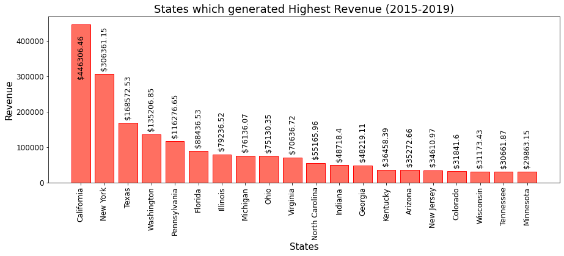

# Eddy Porfolio

I'm eddy and this portolio for data projects

# Project 1: Stack Overflow Exploratory Data Analysis 

### 

This are the results for the 2021 Stack Overflow Survey released every.[Jupyter notebook](https://jupyter.org) hosted on [Jovian](https://www.jovian.ai). We explore the data to get a sense of the experience, income, popular languages and countries of the programmers surveyed _run_ this tutorial and experiment with the code examples in a couple of ways: *using free online resources* (recommended) or *on your computer*.

# Project 2: Sales - EDA
#### Option 1: Running using free online resources (1-click, recommended)

The easiest way to start executing the code is to click the **Run** button at the top.
- Reading a CSV file into a Pandas data frame
- Retrieving data from Pandas data frames
- Querying, soring, and analyzing data
